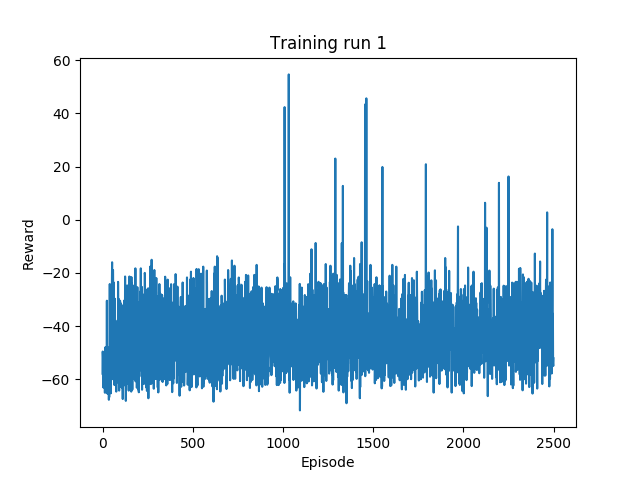
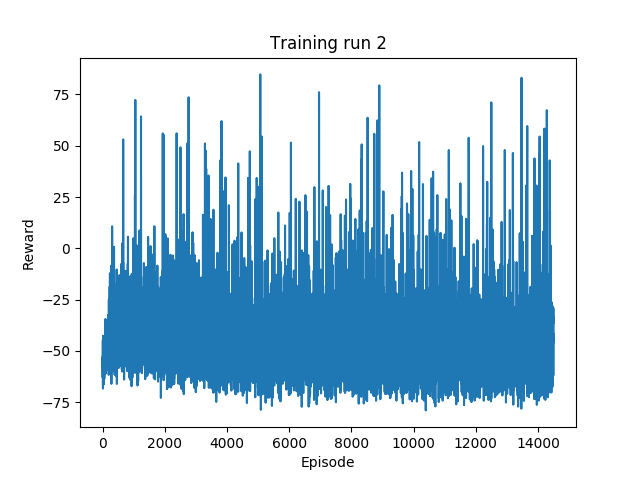

# Checkpoint

## Experiments and Results

### Q-Learning

#### Training Run 1

The first training run was used to establish a baseline for the performance of our agent against the full problem. The issues we encountered in this run inform subsequent experiments.

The first training run used a 84x96, bitpacked, binary state. It had 70% memory usage at 2.5k iterations on my machine at about 16,892,876 KiB (in virtual memory).

*Reward accumulated each episode over the first training run.*

| discount rate | learning rate | epsilon | epsilon decay | epsilon floor |
|--|--|--|--|--|
| 0.99 | 0.01 | 0.9 | N/A | N/A |
*Parameters for training run 1.*

The agent failed to learn, performing similarly to how an agent takin random actions might.

#### Training run 2

The second run downsampled the state to 21x24 in order to reduce the state space.
This also significantly helped memory usage at 12% memory usage at 14.5k iterations.
Lower memory usage than the 84x96 state makes this representation preferable.
This run also saw the introduction of epsilon decay and an epsilon floor.

The agent appears to perform slightly better than in the first training run, more consistently reaching a reward above -20. We attribute this to the smaller state space, though epsilon decay may have contributed. 

*Reward accumulated each episode over the second training run.*

| discount rate | learning rate | epsilon | epsilon decay | epsilon floor |
|--|--|--|--|--|
| 0.99 | 0.01 | 0.9 | 0.99 | 0.01 |
*Parameters for training run 2.*

Both the results from training run 1 and 2 show no significant learning. One could expect similar results from a random agent operating in the environment.

However, this does not indicate that the agent learned nothing at all.
In fact, we observe the agent learned to accelerate down the initial straightaway quite well in the second training run, and to a lesser extent in the first (due to the larger state space).
This is not reflected in the plotted results because we are graphing the total accumulated reward at the end of each episode.
In later episodes, the car accelerates down the initial straightaway, but misses the first turn.
This causes it to go off the track.
The reward continues to deprecate until the time limit (1000 steps) is reached.
Because of this, the final reward per episode metric only measures the total tiles visited, ignoring how quickly the tiles were traversed (unless the full track was completed within 1000 steps). In future runs it would be good to store the maximum reward accumulated within each episode (at any timestep), to reflect this partial learning.

## Difficulties

Initially, storing Q was too memory intensive and caused the OS to send python a kill signal within a few hundred episodes.
This issue has been resolved with bitpacking and downsampling.

The single largest issue is getting the car to make turns.
The car learns well enough in the straightaways, but continues straight off the track.
In randomly generate tracks, the first turn simply presents too many possible states for the agent to encounter them in a reasonable timeframe.
Additionally, randomnly selecting an action will tend to move the car straight ahead rather than moving in a certain direction, as we select between left, straight, or right equally. 

## Next steps

A higher epsilon floor and a slower epsilon decay may help the car to take turns.

We also propose two hueristics which may improve the agent's ability to learn turning.

First, when we select a random action under our e-greedy policy, we could not choose truly randomnly.
Instead, we could choose from a distribution determined from our state such that if more track is present on the left side of the screen, we steer left more often (and similarly for the right).
This can be accomplished by summing the columns of the state and then summing those values within three regions (left, center, right) and choosing an action based on their ratios.
This will encourage the agent to steer left if more track is on the left side of the screen (i.e. there is a left turn) or right if there is more track on the right side of the screen (i.e. there is a right turn).

Second, when the maximum of the state-action values is a tie (such as when we first encounter a state), we currently just select the first action of the action space as it is stored in the array.
In our case, this is steering straight ahead with no brakes or acceleration.
We can use a similar weighting scheme to the first hueristic so that we may select a left or right turn instead.

